# VM Deployment & Setup Log

> **Last Updated:** December 13, 2025 | **Version:** 3.4.0 | **Status:** Fully Operational

This document serves as the authoritative reference for deploying Syndicate on a Virtual Machine (VM). It covers initial configuration, issues encountered during deployment, and their solutions.

---

## Overview

### System Architecture


### Deployment Goals

| Requirement | Description | Status |
|------------|-------------|--------|
| **Zero Root Writes** | No persistent data on root filesystem | Done |
| **Guaranteed Data Survival** | All critical data isolated on dedicated storage volume | Done |
| **Automated Scheduling** | Daily analysis via systemd timers | Done |
| **API Integration** | Gemini, Notion, ImgBB connected | Done |
| **Monitoring Stack** | Prometheus + Grafana + Loki | Done |
| **Data Persistence** | All data on /mnt/newdisk | Done |

---

## Initial System State

### Disk Configuration

**Root Disk**
- **Size:** 50GB
- **Purpose:** OS and core system files only
- **Mount:** /
- **Constraint:** Must NOT store application data

**Data Disk**
- **Size:** 500GB
- **Purpose:** All persistent application data
- **Mount:** /mnt/newdisk
- **Contents:** Application files, Docker volumes, Logs, Database, Output reports
- **Guarantee:** Complete data survival independent of root filesystem state

### Application Architecture

```
syndicate/
|-- main.py          # Core orchestration (Cortex, QuantEngine, Strategist)
|-- run.py           # CLI entry point (daemon, --once, interactive)
|-- docker-compose.yml
|-- .env             # API keys (GEMINI, NOTION, IMGBB)
|-- data/            # Persistent data (memory, database)
|-- output/          # Generated reports and charts
\-- docker/          # Monitoring stack configs
```

### Services Stack

| Service | Purpose | Profile |
|---------|---------|---------|
| gost | Main application | default |
| prometheus | Metrics collection | default |
| grafana | Dashboards | default |
| alertmanager | Alert routing | default |
| loki | Log aggregation | logging |
| promtail | Log collection | logging |
| node-exporter | Host metrics | monitoring |
| cadvisor | Container metrics | monitoring |

---

## Issues and Solutions

> **Production Note:** All solutions documented here have been applied to the source repository as of v3.4.0. New deployments pulling the latest image should not encounter these issues.

### Issue 1: Docker Named Volumes on Root FS

**Problem:** Docker named volumes (gost_data, prometheus_data) stored data in /var/lib/docker/volumes on the root filesystem, violating the zero-writes requirement.

**Solution:**
1. Created bind mount directory: /mnt/newdisk/syndicate/docker-data
2. Replaced named volumes with explicit bind mounts in docker-compose.yml

```yaml
volumes:
  - ./docker-data/gost_data:/app/data
  - ./docker-data/gost_output:/app/output
```

**Verification:**
```bash
# Check no docker volumes on root
df -h /var/lib/docker/volumes

# Verify data on newdisk
ls -la /mnt/newdisk/syndicate/docker-data/
```

---

### Issue 2: Service Logs on Root FS

**Problem:** systemd services wrote logs to /home/user/syndicate_config/ on root disk.

**Solution:**
1. Created config directory on data disk:
```bash
mkdir -p /mnt/newdisk/syndicate/syndicate_config
```

2. Updated service files:
```ini
StandardOutput=append:/mnt/newdisk/syndicate/syndicate_config/run.log
StandardError=append:/mnt/newdisk/syndicate/syndicate_config/run.log
```

3. Reloaded systemd:
```bash
sudo systemctl daemon-reload
```

---

### Issue 3: API Keys Not Loaded

**Problem:** Three API failures:
- NOTION_TOKEN used instead of NOTION_API_KEY
- IMGBB_API_KEY missing entirely
- .env not sourced before docker compose run

**Solution - docker-compose.yml changes:**
```yaml
environment:
  - GEMINI_API_KEY=${GEMINI_API_KEY:-}
  - NOTION_API_KEY=${NOTION_API_KEY:-}    # Fixed name
  - IMGBB_API_KEY=${IMGBB_API_KEY:-}      # Added
  - MPLCONFIGDIR=/tmp/matplotlib           # Added
```

**codex.sh addition:**
```bash
source "/mnt/newdisk/syndicate/.env"
```

---

### Issue 4: --once Flag Ignored

**Problem:** python run.py --once entered daemon mode instead of single execution because the --once argument was parsed but never handled in the control flow.

**Solution - Added explicit handling in run.py:**
```python
# Single run mode (--once) - execute once and exit cleanly
if args.once:
    print_banner()
    print("[ONCE] Running single analysis cycle...")
    run_all(no_ai=args.no_ai, force=args.force)
    _run_post_analysis_tasks()
    print("[ONCE] Single run complete. Exiting.")
    return
```

---

### Issue 5: Matplotlib Permission Error

**Problem:** matplotlib failed creating cache at ~/.cache/matplotlib inside container where goldstandard user lacked write access.

**Solution - Added environment variable to redirect cache:**
```yaml
environment:
  - MPLCONFIGDIR=/tmp/matplotlib
```

---

### Issue 6: cortex_memory.lock Permission Denied

**Problem:** filelock failed creating /app/cortex_memory.lock due to Docker bind mount permission issues.

**Solution:**
1. **Relocated files to data volume** in main.py:
```python
@property
def DATA_DIR(self) -> str:
    return os.path.join(self.BASE_DIR, "data")

@property
def MEMORY_FILE(self) -> str:
    data_dir = self.DATA_DIR
    os.makedirs(data_dir, exist_ok=True)
    return os.path.join(data_dir, "cortex_memory.json")

@property
def LOCK_FILE(self) -> str:
    data_dir = self.DATA_DIR
    os.makedirs(data_dir, exist_ok=True)
    return os.path.join(data_dir, "cortex_memory.lock")
```

2. **Removed cortex_memory mount** from docker-compose.yml

3. **Added user mapping** to codex.sh:
```bash
docker compose run --user "1000:1003" ...
```

---

### Issue 7: FILE_INDEX Filename Explosion

**Problem:** FileOrganizer repeatedly renamed FILE_INDEX.md files, appending dates until [Errno 36] File name too long.

**Solution - Added skip logic in file_organizer.py:**
```python
# Skip FILE_INDEX files to prevent recursive renaming
if filename.startswith("FILE_INDEX") or filename.lower().startswith("file_index"):
    self.logger.debug(f"[ORGANIZER] Skipping index file: {filename}")
    return None
```

---

### Issue 8: systemd CHDIR Error

**Problem:** syndicate-compose.service failed with CHDIR error - corrupted ExecStart line.

**Solution - Recreated service file with explicit bash wrapper:**
```ini
[Service]
ExecStart=/bin/bash -c "cd /mnt/newdisk/syndicate && /usr/bin/docker compose --profile monitoring --profile logging up -d"
```

---

## Automation Schedule

### Timer Overview

```mermaid
gantt
    title Syndicate Automation Schedule
    dateFormat HH:mm
    axisFormat %H:%M

    section Daily
    Analysis Run :05:00, 2h

    section Weekly
    Cleanup Sunday :01:00, 1h
```



### Daily Analysis Timer

> **Service:** syndicate-daily.timer -> syndicate-daily.service

| Parameter | Value | Description |
|-----------|-------|-------------|
| OnCalendar | daily | Runs once per day |
| **Target Time** | 5:00 AM | Configured in service |
| AccuracySec | 1h | Start within 1 hour of scheduled time |
| RandomizedDelaySec | 30m | Random delay to prevent load spikes |
| Persistent | true | Runs on boot if missed |
| **Command** | /home/user/codex.sh run | Triggers Docker container |
| **Logs** | /mnt/newdisk/.../run.log | Persistent on data disk |

### Weekly Cleanup Timer

> **Service:** syndicate-weekly-cleanup.timer -> syndicate-weekly-cleanup.service

| Parameter | Value | Description |
|-----------|-------|-------------|
| OnCalendar | weekly | Runs once per week |
| **Target Time** | Sunday 1:00 AM | Maintenance window |
| AccuracySec | 1h | Flexibility window |
| RandomizedDelaySec | 30m | Stagger execution |
| Persistent | true | Catch up if missed |
| **Logs** | /mnt/newdisk/.../cleanup.log | Persistent on data disk |

### Docker Compose Service

> **Service:** syndicate-compose.service (Boot-time, not timer-based)

| Parameter | Value |
|-----------|-------|
| **Type** | oneshot with RemainAfterExit=yes |
| **WantedBy** | multi-user.target |
| **Restart** | on-failure |
| **Profiles** | monitoring, logging |

---

## Current Status

### Service Health

| Service | Status | Notes |
|---------|--------|-------|
| syndicate-compose.service | active (running) | Docker stack managed |
| syndicate-daily.timer | active (running) | Next trigger scheduled |
| syndicate-weekly-cleanup.timer | active (waiting) | Sunday execution pending |

### Quick Commands

```bash
# Check all services
systemctl status syndicate-*

# View daily timer
systemctl list-timers syndicate-daily.timer

# Manual run
/home/user/codex.sh run

# View logs
tail -f /mnt/newdisk/syndicate/syndicate_config/run.log

# Restart stack
/home/user/codex.sh heal
```

### Data Paths Reference

| Data Type | Path |
|-----------|------|
| Application Data | /mnt/newdisk/syndicate/docker-data/gost_data/ |
| Output Reports | /mnt/newdisk/syndicate/docker-data/gost_output/ |
| Service Logs | /mnt/newdisk/syndicate/syndicate_config/ |
| Environment | /mnt/newdisk/syndicate/.env |
| Prometheus Data | /mnt/newdisk/syndicate/docker-data/prometheus/ |
| Grafana Data | /mnt/newdisk/syndicate/docker-data/grafana/ |

---

## codex.sh Commands

```bash
codex.sh run      # Execute single analysis cycle
codex.sh build    # Rebuild Docker image
codex.sh monitor  # View live logs
codex.sh stop     # Stop all services
codex.sh heal     # Restart and recover services
```

---

> **Deployment Successful** The Syndicate system is fully operational with automated scheduling, persistent storage on the data disk, and all API integrations functional.
